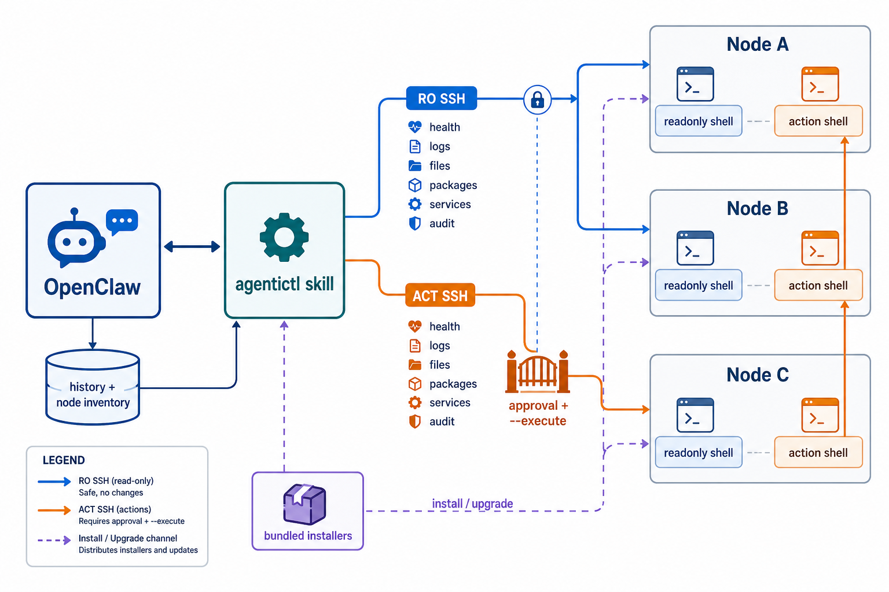

# agentictl

**Safe SSH verbs for agent-managed Linux nodes.**

`agentictl` lets an AI agent inspect and maintain Linux nodes over SSH without giving it a general shell. The node exposes only declared, module-backed verbs such as `health`, `service-status`, `package-list`, `package-upgrades`, and tightly allowlisted maintenance actions.

The first integration target is OpenClaw. This repository includes an OpenClaw skill, node installer, local helper tools, Docker tests, and requirements that describe the security model.

`agentictl` was generated and iterated with help from Codex, OpenAI's AI coding assistant, in collaboration with the project owner.

## Why It Exists

Raw SSH gives an agent too much authority. `agentictl` keeps the useful operational workflow while narrowing the blast radius:

- SSH keys are forced to read-only or action mode.
- Read-only modules can inspect health, services, packages, logs, files under policy, and kernel modules.
- Action commands require allowlists, `--dry-run`, explicit `--execute`, and OpenClaw-side batch approval.
- New operational surfaces are added as root-installed modules, not as arbitrary agent-controlled shell commands.
- Node output is treated as data, not as instructions, to reduce prompt-injection impact.
- Updates and uninstall can be planned first, then executed with an admin SSH account.

## How It Works



The remote accounts are not normal shells. `authorized_keys` forces them into `agentictl readonly` or `agentictl act`.

The runtime is modular: `agentictl` loads root-owned manifests from `/opt/agentictl/modules`, generates `capabilities`, and dispatches only declared verbs for the selected mode.

## Start Here

For a first install, use:

[docs/GETTING_STARTED.md](docs/GETTING_STARTED.md)

That guide is the shortest path for users who want to understand the model, install the skill, install a node, and verify that OpenClaw can reach it.

## Common Tasks

Install the OpenClaw-side helper tools:

```bash
bash skills/agentictl-ssh/resources/install/install-agentictl-skill-tools.sh --bin-dir "$HOME/.local/bin"
```

Verify a read-only node:

```bash
ssh node-ro capabilities
ssh node-ro health
ssh node-ro service-status --unit ollama.service
```

Preview an action:

```bash
ssh node-act package-upgrade --name jq --dry-run
```

Approve one operation across multiple nodes from OpenClaw:

```bash
agentictl-approval-tool.sh plan --target node-a-act --target node-b-act -- package-upgrade --name jq
agentictl-approval-tool.sh dry-run --plan-id APPROVAL_ID
agentictl-approval-tool.sh approve --plan-id APPROVAL_ID
agentictl-approval-tool.sh execute --plan-id APPROVAL_ID
```

Update skill tools and node-side scripts from a local repo:

```bash
agentictl-fleet-sync.sh \
  --source repo \
  --repo-dir /path/to/agentictl \
  --git-pull \
  --openclaw-workspace ~/.openclaw/workspace \
  --admin-user admin \
  --admin-identity ~/.ssh/admin_key \
  --node node.example.net:node-ro:node-act
```

The command prints a plan by default. Add `--execute` only after review.

## Documentation

- [Getting Started](docs/GETTING_STARTED.md): minimal onboarding for new users.
- [OpenClaw Guide](docs/OPENCLAW.md): day-to-day OpenClaw usage, node lifecycle, approvals, and heartbeat suggestions.
- [Modules](docs/MODULES.md): architecture for built-in Linux modules and application-specific verbs.
- [Troubleshooting](docs/TROUBLESHOOTING.md): FAQ for SSH reachability, aliases, passwords, logs, approvals, and updates.
- [Operations](docs/OPERATIONS.md): runtime model, policy, audit, packaging, and Docker harness.
- [Requirements](requirements/README.md): security, functional, packaging, and testing requirements.
- [Adding Verbs](requirements/verbs.md): checklist for extending the command surface.

## Status

This project is early-stage and intentionally conservative. New operational verbs should be added slowly, with tests and documented requirements. The default posture is to deny anything not explicitly declared.

## Core Rule

Agents do not get arbitrary SSH. They get declared verbs.
